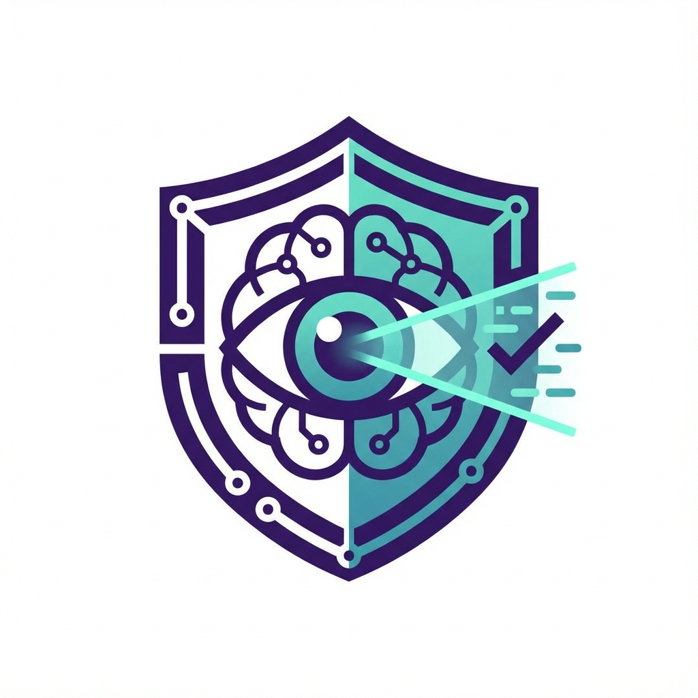

<div align="center">
  
  <h1>🛡️ VeriScan</h1>
  <p><strong>A Comprehensive Security & Academic Verification Platform</strong></p>
  <p><em>Final Year Project  BS Software Engineering</em><br/><em>Under the supervision of <strong>Ms. Sidra Shahid</strong></em></p>
  
  <p>
    
    
    
    
  </p>
</div>

<br/>

## 🌟 Overview

**VeriScan** is an advanced, all-in-one verification suite designed to protect you against modern digital threats. By combining cutting-edge AI detectors with an immutable blockchain logging system, VeriScan ensures the authenticity of digital media, links, and documents.

Whether you're verifying an academic paper or scanning a suspicious email for phishing links, VeriScan has you covered!

---

## 🚀 Key Features

*   🎭 **Deepfake Scanner** — Detects AI-generated manipulation in media files.
*   🎣 **Phishing Detector** — Scans emails and text for social engineering attempts.
*   🔗 **Malicious URL Scanner** — Evaluates links to ensure they are safe to click.
*   📝 **Plagiarism Checker** — Cross-references academic and professional documents for unoriginal content.
*   🕵️ **Metadata Forensics** — Extracts hidden metadata and EXIF data from files to reveal their true origins.
*   ⛓️ **Blockchain Logging** — All verifications are securely logged to an immutable ledger for absolute transparency.

---

## 💻 Tech Stack

| Domain | Technologies |
| :--- | :--- |
| **Frontend** | React 19, Vite, Tailwind CSS, Framer Motion, React Router |
| **Backend** | Python 3.10+, FastAPI, Modular Service Architecture |
| **Database & Auth** | Firebase |
| **Integrations** | Blockchain Services, AI Detection Models |

---

## 🛠️ Getting Started

Follow these steps to get a local copy up and running.

### Prerequisites

*   **Node.js** (v18 or higher)
*   **Python** (v3.10 or higher)

### 1️⃣ Frontend Setup

```bash
# Navigate to the frontend directory
cd frontend

# Install the dependencies
npm install

# Start the Vite development server
npm run dev
```
> The frontend will be available at `http://localhost:5173` ✨

### 2️⃣ Backend Setup

```bash
# Navigate to the backend directory
cd backend

# Install python dependencies
pip install -r requirements.txt

# Start the FastAPI server
fastapi dev main.py
# or uvicorn main:app --reload
```
> The backend API will be available at `http://localhost:8000` 🚀

---

## 📄 License

This project is licensed under the **MIT License**.

<div align="center">
  <sub>Built with ❤️ for Security & Integrity</sub>
</div>
